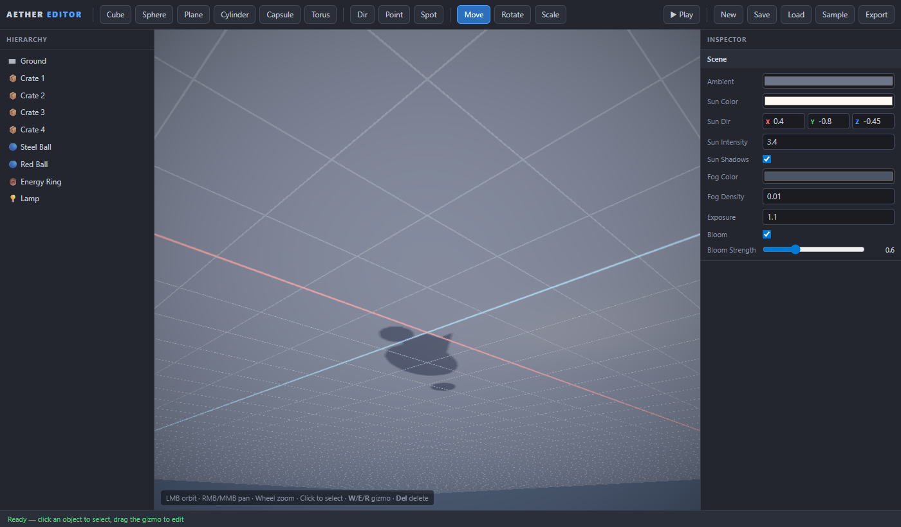

# Aether

A **web-based 3D game engine _and_ visual editor**, built from scratch in TypeScript on raw
WebGL2 — **zero runtime dependencies**. Aether is two things:

1. **The Editor** — a browser application (in the spirit of Godot / PlayCanvas) with a 3D
   viewport, scene hierarchy, property inspector, transform gizmos, play-in-editor, and
   save/load. This is the tool you *build games with*.
2. **The Engine** — the runtime underneath: a physically-based renderer, a data-oriented ECS,
   an impulse-based 3D physics solver, spatial audio, particles, and input.



---

## The Editor

Open the app and you get a full visual scene editor:

- **Viewport** — orbit/pan/zoom camera, a reference grid with world axes, **click-to-select**,
  and **translate / rotate / scale gizmos** you drag to manipulate objects (`W` / `E` / `R`).
- **Hierarchy** — the scene tree; click to select, × to delete, per-type icons.
- **Inspector** — live, grouped property editors for the selected object:
  **Transform** (position/rotation/scale), **Material** (albedo, metallic, roughness, emissive,
  opacity), **Light** (type, color, intensity, range, cones, shadows), and **Physics** (rigid
  body: static/dynamic, mass, restitution, friction). With nothing selected it edits the
  **Scene environment** (ambient, sun, fog, exposure, bloom).
- **Toolbar** — add primitives (cube, sphere, plane, cylinder, capsule, torus) and lights
  (directional/point/spot), switch gizmo mode, and **▶ Play / ■ Stop**.
- **Play-in-editor** — hit Play and the physics simulation runs live; Stop restores the exact
  pre-play scene (snapshot/restore).
- **Save / Load / Export** — scenes persist to browser storage (with autosave) and export to a
  portable JSON file. **Sample** loads a ready-made physics scene to poke at.

Everything is driven by a small command hub (`EditorContext`) and a typed event bus, so panels
stay in sync without any framework.

### Editor controls

| Input | Action |
| --- | --- |
| **LMB drag** | Orbit camera |
| **RMB / MMB drag** | Pan |
| **Wheel** | Zoom |
| **Click object** | Select |
| Drag gizmo handle | Move / rotate / scale the selection |
| `W` / `E` / `R` | Translate / rotate / scale gizmo |
| `Del` | Delete selection |

---

## The Engine

The runtime the editor renders and simulates with — usable on its own as a code-first library
(see [a code example](#using-the-engine-directly)).

- **Renderer (WebGL2, forward HDR)** — physically based shading (Cook–Torrance GGX,
  metallic–roughness), real-time **directional shadow mapping** (PCF), up to 8 dynamic
  point/spot lights, an HDR pipeline (`HALF_FLOAT` → **bloom** → **ACES** tonemap + vignette →
  **FXAA**), normal/emissive/AO maps, and fog.
- **Data-oriented ECS** — sparse-set storage, archetype-free queries, entity recycling.
- **3D physics** — impulse-based rigid bodies (sphere/box/capsule/plane), SAT box–box, sequential
  -impulse solver with friction & restitution, spatial-hash broadphase, sleeping, ray casting.
- **Math** — `Vec2/3/4`, `Quat`, `Mat3/4`, `Color`, all hand-written.
- **Spatial audio** — fully procedural Web Audio (no assets), **particles** (GPU-instanced
  billboards), **input** (keyboard/mouse/gamepad/pointer-lock), **tweening**.

Engine API surface is specified in [CONTRACTS.md](CONTRACTS.md); the editor's internal API in
[EDITOR.md](EDITOR.md).

---

## Quick start

```bash
npm install
npm run dev       # vite dev server → http://localhost:5173  (the Editor)
# or
npm run build     # type-check + production bundle into dist/
npm run preview   # serve the production build
```

- `/` (index.html) → **the Aether Editor**
- `/sandbox.html` → a standalone **physics-sandbox demo** (a first-person playground that drives
  the engine directly — WASD + mouse, click to launch orbs, `G` gravity gun, `F` flashlight)

---

## Using the engine directly

The editor is just one consumer of the engine. You can also script games in code:

```ts
import { Engine } from '@/core';
import { GLContext } from '@/render/gl';
import { Renderer, Camera, Light, Material, Primitives } from '@/render';
import { PhysicsWorld, RigidBody, BodyType } from '@/physics';
import { RenderSystem, Transform, MeshRenderer } from '@/scene';

const canvas = document.querySelector('canvas')!;
const engine = new Engine({ canvas });
const camera = new Camera(); camera.position.set(0, 3, 8);
const physics = engine.use(new PhysicsWorld());
const renderer = engine.use(new Renderer(new GLContext(canvas), { bloom: true, shadows: true }));
engine.use(new RenderSystem(engine.world, renderer, camera));

const e = engine.world.createEntity();
engine.world.add(e, new Transform());
engine.world.add(e, new MeshRenderer(renderer.createMesh(Primitives.sphere(1, 32)),
  new Material({ metallic: 1, roughness: 0.2 })));
physics.addBody(new RigidBody({ kind: 'sphere', radius: 1 }, BodyType.Dynamic, 1));

engine.world.add(engine.world.createEntity(), Object.assign(new Light(), { castShadow: true }));
await engine.start();
```

---

## Architecture

```
src/                 # THE ENGINE (runtime, zero deps)
  core/  math/ ecs/ Engine.ts Time.ts EventBus.ts
  render/ gl/ shaders/ Renderer.ts Camera Light Material Mesh Primitives
  physics/  input/  audio/  particles/  anim/  scene/
editor/              # THE EDITOR (built on the engine)
  core/    EditorContext (command hub), EditorScene, EditorObject, types
  ui/      dom + field-builder helpers (no framework)
  viewport/Viewport (orbit camera, grid, picking) + Gizmo (translate/rotate/scale)
  panels/  Toolbar, HierarchyPanel, InspectorPanel
  main.ts  bootstrap
demo/                # the standalone first-person physics sandbox (sandbox.html)
```

The editor keeps a serializable **data model** (`ObjectJSON` / `SceneJSON`) alongside the live
ECS components, so scenes round-trip to JSON while edits apply to the running engine immediately.
Physics only steps in **play** mode, keeping edit mode static and freely editable.

---

## How it was built

Engine and editor were each implemented by fleets of parallel AI agents coordinated through
locked interface specs ([CONTRACTS.md](CONTRACTS.md), [EDITOR.md](EDITOR.md)): foundation and
subsystem waves for the engine, a hand-written core plus a parallel panel wave for the editor,
each followed by a headless WebGL2 (SwiftShader) verify-and-fix loop that drove rendering,
selection, gizmo-drag, and play-mode physics through a real browser.

## License

MIT
