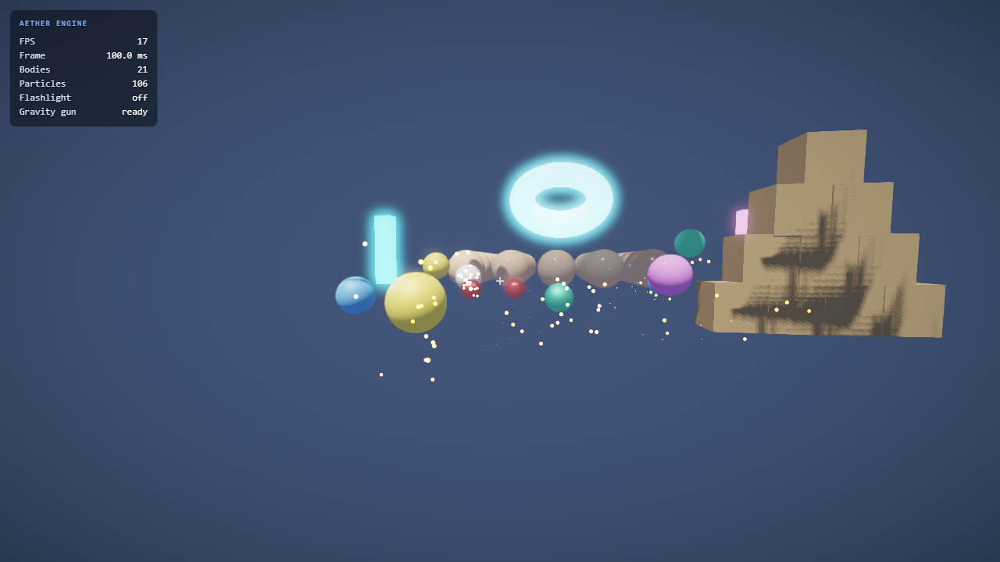

# Aether Engine

A modern, **from-scratch** 3D game engine for the web — built in TypeScript on raw
WebGL2 with **zero runtime dependencies**. Aether implements a real renderer (physically
based shading, real-time shadows, an HDR post-processing stack), a data-oriented ECS, an
impulse-based 3D physics solver, spatial audio, instanced particles, and input — and ships
with a playable first-person physics sandbox that ties it all together.

> The entire engine **and** its demo compile to **~37 KB gzipped**.



---

## Highlights

- **Renderer (WebGL2, forward HDR)**
  - Physically based shading (Cook–Torrance GGX, metallic–roughness workflow)
  - Real-time **directional shadow mapping** with 3×3 PCF and slope-scaled bias
  - Up to 8 dynamic **point / spot** lights + a shadow-casting directional sun
  - Full HDR pipeline into `HALF_FLOAT` targets → **bloom** (threshold + separable
    Gaussian) → **ACES** tonemap + vignette → **FXAA** → present
  - Normal mapping, emissive, AO, exponential fog, transparent pass
- **Data-oriented ECS** — sparse-set storage, archetype-free queries (1–4 components),
  swap-remove deletion, entity recycling
- **3D physics** — impulse-based rigid bodies (sphere / box / capsule / plane), SAT
  box–box, capsule segments, sequential-impulse solver with friction & restitution,
  spatial-hash broadphase, sleeping, and ray casting against every shape
- **Math library** — `Vec2/3/4`, `Quat` (slerp, euler, axis-angle), `Mat3/Mat4`
  (perspective/ortho/lookAt, full inverse, compose/decompose), `Color` (sRGB↔linear)
- **Spatial audio** — fully procedural Web Audio (HRTF panning); impacts, whooshes and
  tones are synthesized — **no audio assets**
- **Particles** — GPU-instanced, camera-facing billboards with additive/alpha blending
- **Input** — keyboard, mouse, wheel, pointer lock, gamepad; frame-accurate
  `wasPressed`/`wasReleased` edges
- **Engine core** — fixed-timestep accumulator loop with interpolation, pluggable modules,
  typed event bus, smoothed clock
- **Tweening** — sequenced tweens with a library of easing functions
- **Procedural geometry** — box, sphere, plane, cylinder, capsule, torus (auto normals &
  tangents) — the demo needs **no external assets**

Everything is authored against a single source-of-truth API spec ([CONTRACTS.md](CONTRACTS.md)).

---

## Quick start

```bash
npm install
npm run dev      # vite dev server → http://localhost:5173
# or
npm run build    # type-check + production bundle into dist/
npm run preview  # serve the production build
```

Open the page, **click to enter**, and play.

### Demo controls

| Input | Action |
| --- | --- |
| `W` `A` `S` `D` | Move (hold `Shift` to sprint) |
| Mouse | Look (pointer-locked) |
| `Space` | Jump |
| **Click** | Launch a glowing physics orb |
| `G` | Gravity gun — grab the object you're aiming at; click to fling it |
| `F` | Toggle the flashlight (a spotlight that follows you) |

The sandbox showcases a 5×5 PBR metallic/roughness sphere grid, four emissive corner
pillars each lit by a matching point light, a tumbling emissive energy ring, a knock-down
crate pyramid and a pile of dynamic balls that settle on load — all under a sweeping,
shadow-casting sun with bloom and spatial-audio impacts.

---

## Using the engine

```ts
import { Engine } from '@/core';
import { Vec3, Color } from '@/core/math';
import { GLContext } from '@/render/gl';
import { Renderer, Camera, Light, Material, Primitives } from '@/render';
import { PhysicsWorld, RigidBody, BodyType } from '@/physics';
import { RenderSystem, Transform, MeshRenderer } from '@/scene';

const canvas = document.querySelector('canvas')!;
const glx = new GLContext(canvas);
const engine = new Engine({ canvas });

const camera = new Camera();
camera.position.set(0, 2, 8);

const physics = engine.use(new PhysicsWorld());
const renderer = engine.use(new Renderer(glx, { bloom: true, shadows: true }));
engine.use(new RenderSystem(engine.world, renderer, camera));

// A falling PBR sphere
const mesh = renderer.createMesh(Primitives.sphere(1, 32));
const e = engine.world.createEntity();
engine.world.add(e, new Transform());
engine.world.add(e, new MeshRenderer(mesh, new Material({ metallic: 1, roughness: 0.2 })));
physics.addBody(new RigidBody({ kind: 'sphere', radius: 1 }, BodyType.Dynamic, 1));

// A sun
const sun = new Light(/* Directional */);
sun.castShadow = true;
engine.world.add(engine.world.createEntity(), sun);

await engine.start();
```

---

## Architecture

A fixed-timestep [`Engine`](src/core/Engine.ts) drives an ordered list of pluggable
**modules** (`update → fixedUpdate×N → lateUpdate → render`). Game state lives in a
sparse-set [`World`](src/core/ecs/World.ts); systems query it each frame.

```
src/
  core/
    math/        Vec2/3/4, Quat, Mat3/4, Color, MathUtils
    ecs/         World (sparse-set ECS)
    Engine.ts    fixed-timestep loop + module orchestration
    Time.ts EventBus.ts
  render/
    gl/          GLContext, Shader, VertexArray, Texture, Framebuffer (WebGL2 wrapper)
    shaders/     PBR, depth, post-processing GLSL (ES 3.00)
    Renderer.ts  shadow → PBR (HDR) → bloom → tonemap → FXAA pipeline
    Camera, Light, Material, Mesh, Primitives
  physics/       PhysicsWorld (broadphase + narrowphase + solver), RigidBody
  input/         Input (keyboard/mouse/gamepad/pointer-lock)
  audio/         AudioEngine (procedural spatial Web Audio)
  particles/     ParticleSystem (instanced billboards)
  anim/          Tween, TweenManager, Ease
  scene/         Transform, MeshRenderer, RenderSystem (ECS ↔ renderer glue)
demo/
  main.ts        bootstrap + render settings + UI
  Game.ts        the first-person physics sandbox
```

### Design notes

- **No runtime dependencies.** Vectors, matrices, the WebGL2 abstraction, the PBR shaders,
  the physics solver and the audio synthesis are all hand-written.
- **Right-handed, Y-up**, column-major `Float32Array` matrices uploaded straight to WebGL.
- **HDR-correct**: lighting is computed in linear space into `HALF_FLOAT` buffers; tone
  mapping and sRGB encoding happen once, at the end, in the composite pass.
- **Stable physics**: penetration slop + Baumgarte positional correction + a restitution
  threshold keep resting stacks from jittering or sinking.

---

## How it was built

This engine was implemented by a fleet of parallel AI agents coordinated through a single
locked interface spec ([CONTRACTS.md](CONTRACTS.md)): a foundation wave (math, ECS, engine
core, GL wrapper, input, audio) followed by a subsystems wave (renderer + shaders, physics,
animation, particles, scene glue), then hand integration of the demo and a headless WebGL2
(SwiftShader) smoke-test loop to drive the render-and-fix cycle.

---

## License

MIT
